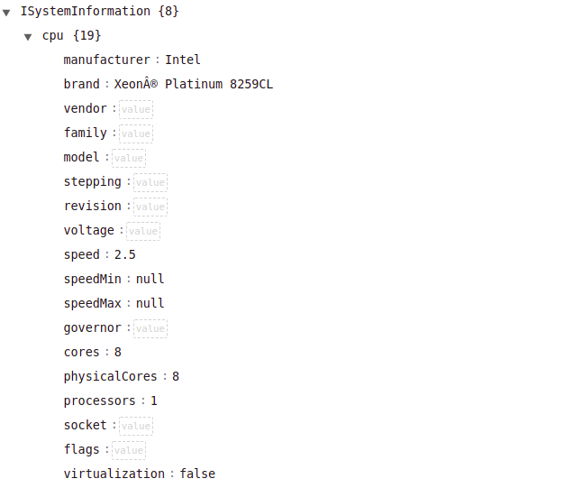

### QUESTROY Hugo 

# Compte Rendu 


Lien du repository : https://github.com/Popoleii/i_want_typescript

## TD 1 : Une application Node.js

2. `package.json` contient les informations du projet avec les dépendances, la description, l'auteur etc.

Le fichier `package-lock.json` recense tous les modules node utilisés. 

3. Pour `package.json` on a l'ajout d'une nouvelle dépendance `systeminformation`. On a la même chose sur `package-lock.json`.

4. La principale difficulté était pour moi les fonctions asynchrones : C'est en effet la première fois que je faisait face à ce genre de fonction. 

5. Cela permet de laisser place à des améliorations, des v2 etc.

6. L'intérêt du jeu de test est de pouvoir verifer que si l'on modifie l'application, ce qu'on a implémenté par le passé fonctionne toujours.


## TD2 : Conteneurisation avec Docker 


4. Le flag `-p` sert à définir les ports, le flag `-m` sert à définir la mémoire allouée et le flag `--cpus` sert à choisir le nombre de cpu utilisés. 

5. L'image possède des programmes qui ne lui sont pas utiles à l'utilisation mais uniquement à l'installation (comme git par exemple). Il faut donc créer un builder et un runner qui sera plus léger. 

6. Pour le premier docker on a une taille de l'app de 232MB. Après avoir modifié le dockerfile: en ne copiant que les parties utiles on a maintenant une taille de l'image de 189MB! 

**UPDATE: **
Changement par rapport à mardi, j'ai modifié le docker pour ne garder que les dépendances de production : 
``` dockerfile
RUN npm install --only=production 
 RUN cp -R node_modules prod_module
 RUN npm install
 RUN npm run build 
```

 l'image fait maintenant 58.6MB  !! 

 J'ai également modifié le Dockerfile pour faire la diminution des droits user. 

8.  `sudo docker pull popoleii/sysinfo-api:0.0.2` pour télécharger mon image publiée, puis après je build normalement. 


## TD3 : CI/CD avec GitHub

3. Pour tester le bon fonctionnement j'ai fait en sorte que les tests ne soient pas réussi et j'ai vérifié que si je pushais, cela ne se deployait pas sur dockerhub. 

4. Ici les difficultés ont surtout été de construire le fichier yalm et de gérer les authentifications sur DockerHub depuis GitHub. 

## TD4 : déploiement sur PaaS avec Heroku

3. Le process type est le type d'application que l'on veut implementer. Pour une application web comme la notre il faut mettre "web". 

4. L'application ne fonctionne pas Le port est assigné dynamiquement sur heroku, il faut donc modifier l'appli pour assigner dynamiquement le port. 

5. c'est le point VII : Associations de ports.

6. On récupère donc les informations de la machine: C'est un Intel Xeon Platinum 8259CL. 



Sur une machine virtuelle on aurait seulement les informations allouées à la VM qui seraient visibles.

7. Pour automatiser le déploiement sur Heroku j'ai modifié le fichier yml de cette façon : 

 ```yaml
    - name: Connect on Heroku w Docker
      env:
          HEROKU_API_KEY: ${{ secrets.HEROKU_API_KEY }}
          HEROKU_EMAIL: ${{ secrets.HEROKU_EMAIL }}
      run: docker login --username=$HEROKU_EMAIL --password=$HEROKU_API_KEY registry.heroku.com

    - run: docker tag sysinfo-api:0.0.2 registry.heroku.com/sysinfo-api-popoleii/web
    - run: docker push registry.heroku.com/sysinfo-api-popoleii/web
    - name: Release on Heroku ! 
      env:
          HEROKU_API_KEY: ${{ secrets.HEROKU_API_KEY }}
          HEROKU_EMAIL: ${{ secrets.HEROKU_EMAIL }}
      run: heroku container:release web -a sysinfo-api-popoleii 
 ```
