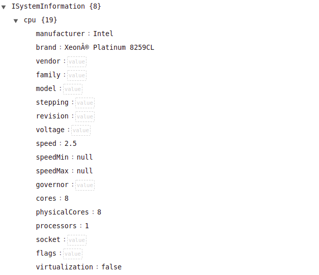

### QUESTROY Hugo 

# Compte Rendu 

1. `package.json` contient les informations du projet avec les dépendances, la description, l'auteur etc.

Le fichier `package-lock.json` recense tous les modules node utilisés. 

2. Pour `package.json` on a l'ajout d'une nouvelle dépendance `systeminformation`. On a la même chose sur `package-lock.json`.

Docker : 

4. Le flag `-p` sert à définir les ports, le flag `-m` sert à définir la mémoire allouée et le flag `--cpus` sert à choisir le nombre de cpu utilisés. 

5. L'image possède des programmes qui ne lui sont pas utiles à l'utilisation mais uniquement à l'installation (comme git par exemple). Il faut donc créer un builder et un runner qui sera plus léger. 

6. Pour le premier docker on a une taille de l'app de 232MB. Après avoir modifié le dockerfile: en ne copiant que les parties utiles on a maintenant une taille de l'image de 189MB! 

8.  sudo docker pull popoleii/sysinfo-api:0.0.2

9. Pour tester le bon fonctionnement j'ai fait en sorte que les tests ne soient pas réussi et j'ai vérifié que si je pushais, cela ne se deployait pas sur dockerhub. 

question probleme cli. Le port est assigné dynamiquement sur heroku, il faut donc modifier l'appli pour assigner dynamiquement le port. 

c'est le point VII : Associations de ports.

